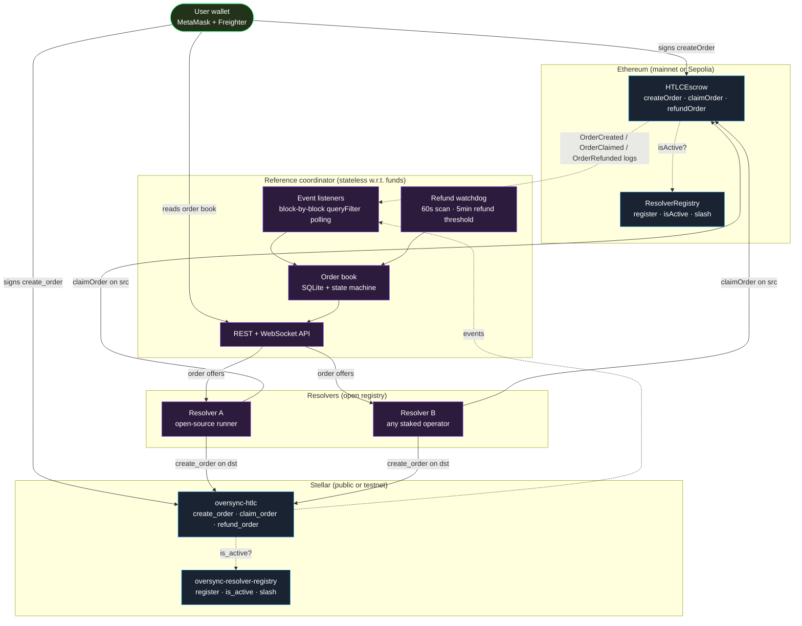
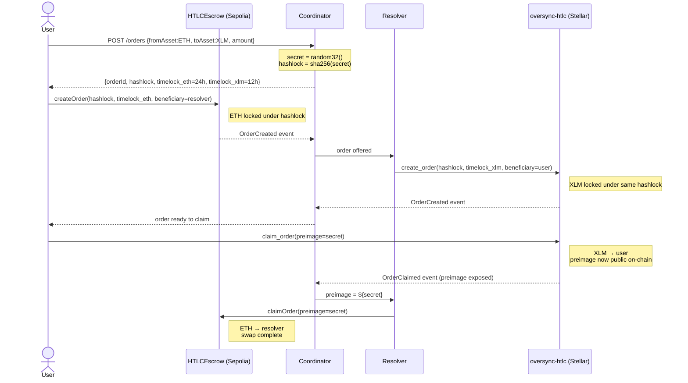
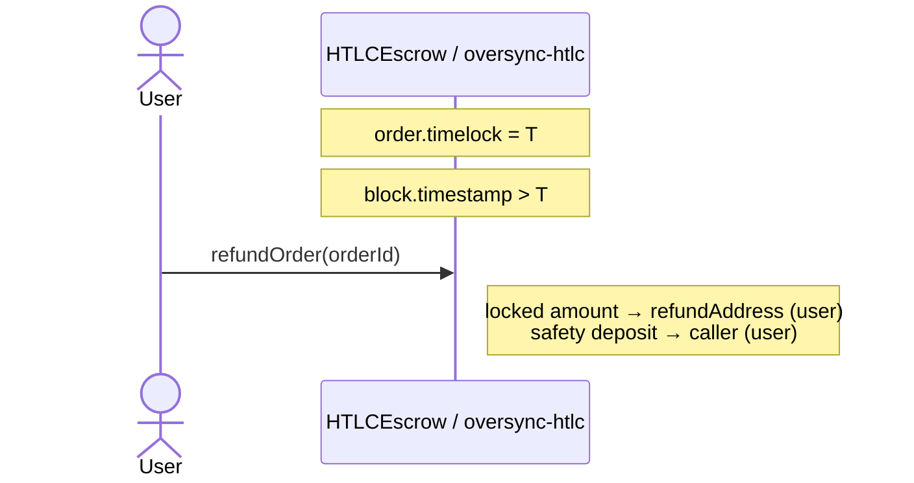
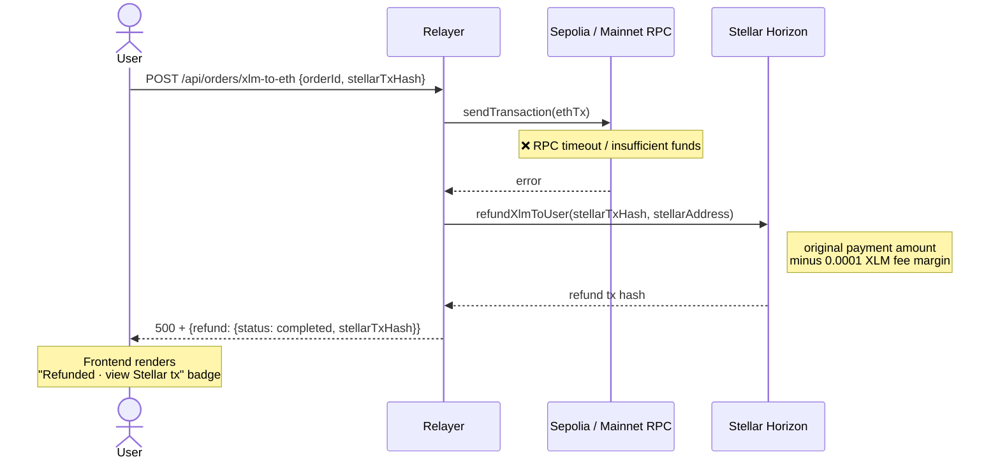

# OverSync v2 — Architecture

> **Status:** OverSync is being rebuilt as a non-custodial, multi-resolver,
> HTLC-based bridge between Ethereum and Stellar. This document tracks the
> **target** architecture. Code in this repository is in the middle of the
> v1 → v2 transition; sections that describe behaviour not yet shipped are
> marked **`(planned)`**.

Bridges are responsible for some of the largest losses in DeFi history.
Reviewers and integrators are right to demand a precise, verifiable
description of how a bridge works before trusting it with funds. This
document is intentionally exhaustive on the points that matter — trust
boundaries, atomicity invariants, failure modes, and the exact ledger
state we modify — so a reader can audit the design before reading code.

---

## 1. Design goals

OverSync v2 is built around three load-bearing properties.

### 1.1 Non-custodial by construction

User funds are locked in HTLC contracts on both chains. The contracts
have no admin escape hatch (no `emergencyWithdraw`, no `pause`, no
`upgradeTo`). Locked funds can only move under exactly two on-chain
conditions:

1. A caller submits a `preimage` such that
   `sha256(preimage) == hashlock` (or `keccak256(preimage) == hashlock`
   on the EVM side) **and** `block.timestamp <= timelock`. The locked
   amount goes to `beneficiary`.
2. `block.timestamp > timelock` and any caller invokes `refund_order`.
   The locked amount returns to `refund_address`, which the contract
   pins to the original user at order-creation time.

Any other call path reverts. The deployer's key, the coordinator's
key, and the resolver's key cannot circumvent these conditions.

### 1.2 Multi-resolver

Anyone can register as a resolver by staking an ERC-20 (Ethereum side)
or Stellar asset (Stellar side) into the `ResolverRegistry`. The
registry exposes `isActive(address) → bool` which the HTLC contract
reads to gate **order creation** (so the off-chain order book stays
sybil-resistant). The registry does **not** gate `claim` or `refund` —
those remain permissionless even after registry compromise.

Misbehaviour is slashable by the registry owner (intended to become a
2-of-3 multisig before mainnet, then a Timelock+Governor DAO before
high TVL). Slashing routes funds to a `slashBeneficiary`, not to the
admin EOA.

### 1.3 Symmetric HTLC semantics

Both contracts enforce the same invariants with the same parameters:

| Parameter | Ethereum (`HTLCEscrow.sol`) | Stellar (`oversync-htlc`) |
|---|---|---|
| Minimum timelock | `MIN_TIMELOCK = 300` (5 min) | `MIN_TIMELOCK_SECONDS = 300` |
| Maximum timelock | `MAX_TIMELOCK = 86_400` (24 h) | `MAX_TIMELOCK_SECONDS = 86_400` |
| Hashlock digest | sha256 **or** keccak256 of preimage | sha256 of preimage |
| Refund delivery | permissionless, paid to `refundAddress` | permissionless, paid to `refund_address` |
| Safety deposit | configurable via `minSafetyDeposit` | configurable via `min_safety_deposit` |
| Admin role over locked funds | none | none |

The EVM contract accepts either sha256 or keccak256 because EVM tooling
expects keccak by default but the Soroban side can only verify sha256.
A single cross-chain swap uses sha256 end-to-end; the keccak path is
provided for compatibility with classic EVM-only HTLC flows.

---

## 2. Why HTLCs (and not validator-set or attester bridges)

OverSync deliberately gives up some properties of validator-set
bridges in exchange for a strictly weaker trust assumption. The
[`docs/DIFFERENTIATION.md`](docs/DIFFERENTIATION.md) document covers
the competitive landscape in detail; in short:

| Compromise that lets attacker steal locked funds | Validator-set bridge (Axelar ITS, Allbridge, Wormhole-style) | OverSync v2 |
|---|---|---|
| Compromise an off-chain signer quorum | **Yes** | **No** — no privileged signer exists in the HTLC |
| Compromise a first-party attester service (Circle, etc.) | **Yes** (for CCTP-style bridges) | **No** — no attester is consulted |
| Break sha256 | No | Yes, but this breaks all of crypto |
| Compromise Ethereum or Stellar consensus | Yes (both) | Yes (both) |

In other words, OverSync inherits the trust assumptions of the
underlying chains and adds nothing on top. The reward of this trade is
weaker — slower UX, higher per-swap gas overhead, no support for
arbitrary chains without an HTLC on each — and we accept that.

---

## 3. System topology



**Critical property:** funds never sit anywhere except the two HTLC
contracts. The coordinator is a metadata service; the resolvers are
independent economic actors. The dashed arrows are read-only event
flows — the coordinator and resolvers have no signing authority over
user funds.

---

## 4. The atomic-swap flow

### 4.1 Direction: ETH → XLM (happy path)



**Atomicity guarantee.** Both legs settle, or both legs refund. The
cryptographic correspondence makes this provable:

- If the user claims XLM first, the preimage becomes public on
  Stellar. The resolver (or anyone) can then claim ETH on Ethereum
  using the same preimage before `timelock_eth` expires.
- If the user never claims, `timelock_xlm < timelock_eth` is chosen
  so the resolver's Stellar refund expires first. The resolver
  refunds, and the user can refund their Ethereum side 12h later.

### 4.2 Direction: XLM → ETH (happy path)


The roles of the two chains swap. The Soroban contract emits
`OrderCreated`, `OrderClaimed`, `OrderRefunded` events with the same
shape as the EVM side, so the coordinator's listener and state-machine
code is shared across both directions.

### 4.3 Timelock ordering invariant

To preserve atomicity, the destination-side timelock is **shorter**
than the source-side timelock. By convention:

```
timelock_source = now + 24 h        # user-side
timelock_dest   = now + 12 h        # resolver-side
```

This ordering ensures the resolver's destination refund expires first.
If the user delays past the destination refund, the resolver gets its
funds back and the user's source side will refund 12h later. If the
ordering were reversed, the user could claim destination after the
source had already refunded — breaking atomicity. The contracts
enforce only the absolute bounds (`MIN_TIMELOCK ≤ t ≤ MAX_TIMELOCK`);
the ordering invariant is enforced by the coordinator's order builder
and verified by the resolver before it locks destination-side funds.

---

## 5. Components

### 5.1 Ethereum contracts (`contracts/contracts/v2/`)

#### `HTLCEscrow.sol`

- `createOrder(...) returns (uint256 orderId)` — locks `amount` of
  `asset` (native ETH or any ERC-20) under `hashlock` and `timelock`.
  Optionally gated by `ResolverRegistry.isActive`. Stores
  `refundAddress = msg.sender`; this can never be re-pointed.
- `claimOrder(uint256 orderId, bytes32 preimage)` — pays the locked
  amount to `beneficiary` if `sha256(preimage) == hashlock` or
  `keccak256(preimage) == hashlock`, and the safety deposit to
  `msg.sender`.
- `refundOrder(uint256 orderId)` — permissionless after `timelock`.
  Pays the locked amount to `refundAddress` and the safety deposit to
  `msg.sender`.
- `MIN_TIMELOCK = 300` (5 min), `MAX_TIMELOCK = 86_400` (24 h).
- No `onlyOwner` function exists. No admin role can move locked
  funds. Verified by Hardhat test
  `non-custodial guarantees > contract has no admin escape hatch`.
- `ReentrancyGuard` on every state-changing function.
- ERC-20 transfers use OpenZeppelin `SafeERC20`.

#### `ResolverRegistry.sol`

- `register(uint256 stake)` — stakes `stakeAsset` into the registry.
- `increaseStake(uint256 delta)` / `unregister()` — let resolvers
  adjust their own stake.
- `isActive(address resolver) → bool` — read by `HTLCEscrow`.
- `slash(address resolver, uint256 amount)` — `onlyOwner`, sends
  `stakeAsset` to `slashBeneficiary` (not to the owner).
- `Ownable2Step` for owner transfer (no single-tx hijack).

### 5.2 Soroban contracts (`soroban/contracts/`)

#### `oversync-htlc`

- `create_order(env, sender, beneficiary, refund_address, hashlock,
  timelock, asset, amount, safety_deposit)` — locks the asset under
  the standard HTLC commitments. Stores the entire order in a
  Soroban `Map<u64, Order>` keyed by an autoincrementing
  `next_order_id`. Emits the `OrderCreated` event.
- `claim_order(env, order_id, preimage)` — `sha256(preimage) ==
  hashlock` and `env.ledger().timestamp() <= timelock` are required.
  Asset transferred to `beneficiary`, safety deposit to `caller`.
- `refund_order(env, order_id)` — permissionless after `timelock`;
  asset to `refund_address`, safety deposit to `caller`.
- 10 unit tests in `soroban/contracts/htlc/src/test.rs` covering
  happy path, wrong preimage, expiry, double claim, refund after
  claim, timelock bounds, safety deposit minimum, admin
  initialisation.

#### `oversync-resolver-registry`

- `register(env, resolver, stake_token, amount)` —
  stake-transferred into the contract.
- `unregister(env, resolver)` — refund stake if not slashed.
- `slash(env, resolver, amount)` — admin-only; sends to
  `slash_beneficiary`.
- `is_active(env, resolver) → bool`.

### 5.3 Coordinator (`coordinator/`)

A reference Node.js service split into the following modules:

| Module | Responsibility |
|---|---|
| `src/listeners/ethereum-listener.ts` | viem `watchEvent` subscription to `HTLCEscrow` logs. Tags each event with block number for ordering. |
| `src/listeners/soroban-listener.ts` | Polls `getEvents` against the Soroban RPC; resumes from the last persisted ledger sequence on restart. |
| `src/state-machine/order-machine.ts` | XState-style state machine: `Created → Locked → SecretRevealed → Claimed | Refunded | Expired`. The same machine is exported from the SDK so the frontend and coordinator agree on transitions. |
| `src/services/order-service.ts` | Drives orders through the state machine. Refuses transitions that would violate invariants. |
| `src/services/quote-service.ts` | CoinGecko-backed price quote; not on the critical path for fund safety, only for displaying expected outcomes. |
| `src/services/secret-service.ts` | Generates secrets, hashes them, and persists them encrypted-at-rest. Only releases a secret if the corresponding on-chain HTLC has been observed locked. |
| `src/persistence/` | `node:sqlite` (Postgres for production). Schema in `schema.sql`. Order rows are immutable except for the `status` and `last_event_block` fields. |
| `src/server/` | Express routes for `/health`, `/orders`, `/quotes`, `/secrets`. JSON Schema-validated via zod. |
| `src/index.ts` | < 200 lines of bootstrap. The old 3,276-line `relayer/src/index.ts` is gone. |

The coordinator has **no private keys that can move user funds**. It
holds a server-side key only for signing its own metadata responses
(if at all) and for posting transactions to its own RPC endpoint
(no signing authority on the HTLC contracts).

### 5.4 Resolver runner (`resolver/`)

A standalone TypeScript CLI plus Docker image. Anyone who has staked
into the `ResolverRegistry` can run an instance:

```bash
docker run ghcr.io/oversync/resolver:latest register
docker run ghcr.io/oversync/resolver:latest run
```

The runner subscribes to the coordinator's order book and on-chain
events, decides which orders to fill (based on its own pair/amount
configuration), and signs the destination-side HTLC creation. The
runner ships with sensible defaults but every parameter is
configurable; community resolvers are not bound to OverSync's
reference economics.

### 5.5 Frontend (`frontend/`)

React 18 + Vite. Key behaviours relevant to architecture:

- All HTLC interactions go through `@oversync/sdk` so the frontend
  shares the secret-generation and state-machine code with the
  coordinator. There is no second source of truth.
- Network mode is centralised in
  [`src/lib/useNetworkMode.ts`](frontend/src/lib/useNetworkMode.ts):
  the URL `?network=`, the MetaMask chain id, and the Freighter network
  passphrase are reconciled. A `NetworkMismatchBanner` warns and
  offers one-click reconciliation when they diverge.
- `RefundDialog` calls `refundOrder` directly from the user's wallet,
  so users can recover funds without the coordinator participating.
- All `console.*` calls are stripped from production bundles via
  Vite's `esbuild.drop` and source maps are disabled, so demo
  visitors do not see internal state in devtools.

### 5.6 SDK (`packages/sdk/`)

`@oversync/sdk` is the shared layer:

- `EthereumHTLCClient` (viem-based) — typed wrapper around the EVM
  contract.
- `SorobanHTLCClient` — typed wrapper around the Soroban contract;
  signer is a callback so any wallet integration plugs in.
- `secrets/` — `generateSecret`, `hashSecret`, `verifyPreimage` with
  sha256 + keccak256 support.
- `state-machine/` — the shared state machine consumed by the
  coordinator and the frontend.
- `types/` — `Order`, `OrderStatus`, `ChainLeg`, `ResolverInfo`,
  `Direction`.

---

## 6. Refund mechanisms

OverSync ships **four independent refund layers**. Each is a backstop
for the previous one. The first two are pure on-chain primitives — they
work even if every OverSync server is offline. The last two are
operator-side conveniences that reduce time-to-recovery from "wait one
timelock cycle" to "minutes" in the common XLM→ETH failure mode where
the user has already paid into a relayer-owned Stellar account.

### 6.1 On-chain HTLC refund (primary)

Both contracts expose `refundOrder(orderId)` (EVM) /
`refund_order(env, order_id)` (Soroban). The function is **permissionless**:
any caller can invoke it after `timelock` and the contract pays the
locked amount to `refundAddress` (pinned to the user at create-time)
plus the safety deposit to the caller as a gas reimbursement.

This is the only guarantee the system needs. Every other refund layer
is an optimisation on top of this one.



### 6.2 Frontend refund dialog (UX layer)

The frontend's transaction history shows a **"Refund ETH" button** on
any pending or failed ETH→XLM swap once the timelock has expired. The
button calls the contract directly from the user's wallet — the
coordinator does not participate. See
[`frontend/src/features/refund/RefundDialog.tsx`](frontend/src/features/refund/RefundDialog.tsx).

The dialog supports both v2 `HTLCEscrow` (uint256 ids) and the v1
`MainnetHTLC` (bytes32 ids) so users on the live mainnet bridge get
the same one-click recovery as testnet users.

Refund metadata (`onChainOrderId`, `htlcContractAddress`,
`timelockUnixSeconds`, `amountWei`) is captured from the ETH receipt
via [`parseHtlcReceipt`](frontend/src/lib/parseHtlcReceipt.ts) at swap
creation time and persisted in `localStorage`, so the refund button
remains usable across browser sessions.

### 6.3 Inline automatic XLM refund

XLM→ETH is structurally asymmetric in v1: the user pays XLM into a
relayer-owned Stellar account as a plain payment (no HTLC on the
source side, because Soroban HTLC was not yet integrated end-to-end
in the mainnet path). If the subsequent ETH release fails — RPC
timeout, insufficient relayer balance, gas estimation error — the
user's XLM would otherwise be stranded.

To close this gap, the relayer's `/api/orders/xlm-to-eth` endpoint
wraps the ETH-send in a try/catch and on failure synchronously
triggers an XLM refund back to the user:



Implementation: [`relayer/src/xlm-refund.ts`](relayer/src/xlm-refund.ts)
and the catch block in [`relayer/src/index.ts`](relayer/src/index.ts).
The frontend persists `refundTxHash` + `refundNetwork: 'stellar'` so
the user can verify the refund on Stellar Expert.

### 6.4 Background refund watchdog

Layer 6.3 only fires while the user's HTTP request is in flight. If
the user closes their tab right after sending XLM, or the relayer's
process is restarted (Render redeploy, OOM, etc.) before the ETH
release completes, the inline refund cannot run.

The watchdog ([`relayer/src/refund-watchdog.ts`](relayer/src/refund-watchdog.ts))
is the safety net for that case. It runs as a `setInterval` inside the
relayer process and:

1. Every **60 seconds**, scans the in-memory `activeOrders` map.
2. For each `direction = 'xlm_to_eth'` order with `xlmReceivedAt`
   older than **5 minutes** and no `ethTxHash` recorded, triggers
   the same refund helper as layer 6.3.
3. Stamps successful refunds with `status = 'refunded'`,
   `refundTxHash`, `refundedAt` so a subsequent tick does not
   double-pay.
4. On refund failure, sets `watchdogFailedAt` and backs off for 10
   minutes before retrying. Errors are logged per-order but never
   thrown into the event loop.

The watchdog uses the same `refundXlmToUser` helper as the inline
path, so the refund amount logic and signing key are identical.

### 6.5 Coverage matrix

| Failure mode | Layer 6.1 (on-chain) | Layer 6.2 (UI) | Layer 6.3 (inline) | Layer 6.4 (watchdog) |
|---|---|---|---|---|
| ETH→XLM user never claims | ✅ refund after `timelock_eth` | ✅ one-click button surfaces | n/a | n/a |
| ETH→XLM resolver never fills | ✅ refund after `timelock_eth` | ✅ one-click button surfaces | n/a | n/a |
| XLM→ETH ETH RPC fails mid-request | ⚠️ no HTLC on XLM side in v1 path | n/a | ✅ refund in same HTTP response | n/a |
| XLM→ETH user closes tab post-payment | ⚠️ same as above | n/a | n/a | ✅ refund within ~6 min |
| XLM→ETH relayer restarts mid-flight | ⚠️ same as above | n/a | n/a | ✅ refund within ~6 min |
| Coordinator entirely offline | ✅ user calls refund directly | ✅ frontend works without coordinator | n/a | n/a |
| Relayer entirely offline | ✅ user calls refund directly | ✅ frontend works without relayer | n/a | n/a |

In v2 the XLM→ETH path also goes through the Soroban HTLC, so layer
6.1 alone is sufficient on both directions and layers 6.3 + 6.4 become
redundant. Layers 6.3 + 6.4 remain in the relayer as defence-in-depth
for any legacy v1 mainnet deployments; the public frontend does not
expose mainnet while `VITE_MAINNET_ENABLED=false`.

---

## 7. Cryptographic primitives

OverSync's safety properties bottom out on three primitives. Each is
deliberately conservative.

### 7.1 Hash function (hashlock)

| Property | Choice | Rationale |
|---|---|---|
| Default digest | `sha256` (32 bytes) | Both EVM and Soroban natively support sha256; lets a single preimage be reused across both chains in one swap |
| EVM compatibility | `keccak256` accepted as alternative | Lets pure-EVM tools (Foundry, Hardhat, classic atomic-swap libraries) plug in without re-hashing |
| Preimage size | 32 bytes (256 bits) | Brute-force resistance ≥ 2^256; ample margin |
| Preimage source | `crypto.getRandomValues` (browser) / `crypto.randomBytes` (Node) | CSPRNG; never a deterministic derivation from order metadata |

The dual-hash support is verified by a Hardhat test that creates an
order with a `sha256(s)` hashlock and claims it with the same `s` and
again with `keccak256(s)` as a control — only the matching one
succeeds. See `contracts/test/v2/HTLCEscrow.t.ts`.

### 7.2 Timelocks

| Parameter | Value | Where enforced |
|---|---|---|
| `MIN_TIMELOCK` | 300 seconds (5 minutes) | `HTLCEscrow.sol` constant + `oversync-htlc` constant |
| `MAX_TIMELOCK` | 86,400 seconds (24 hours) | both contracts |
| `timelock_source` (convention) | now + 24h | coordinator order builder |
| `timelock_dest` (convention) | now + 12h | coordinator order builder + resolver verifies |
| Resolver verification | resolver MUST refuse orders where `timelock_dest >= timelock_source - ε` | off-chain runner |

The on-chain contracts only enforce `MIN ≤ t ≤ MAX`. The ordering
invariant (`timelock_dest < timelock_source`) is enforced off-chain
because it depends on per-pair latency targets the resolver chooses.
This is the single trust point a resolver implementer must get right.

### 7.3 Signature schemes

The HTLC contracts themselves do not verify signatures — they verify
hash preimages, which is a strictly simpler operation. The
*transactions* that interact with the contracts are signed by:

| Actor | Chain | Scheme |
|---|---|---|
| User | Ethereum | secp256k1 via injected wallet (MetaMask / Rabby / WalletConnect) |
| User | Stellar | Ed25519 via Freighter or other Stellar wallet |
| Resolver | Ethereum | secp256k1 — resolver-managed hot key |
| Resolver | Stellar | Ed25519 — resolver-managed hot key |
| Coordinator | none | the coordinator never signs HTLC transactions |

The coordinator's REST/WebSocket API does not authenticate users at
the API layer — anyone can read the public order book. State-changing
calls go directly to the chains.

---

## 8. Operational characteristics

This section quantifies the cost and latency profile so reviewers do
not have to derive it from code.

### 8.1 End-to-end latency (testnet measurements, May 2026)

| Stage | Typical | P95 | Bottleneck |
|---|---|---|---|
| Order creation HTTP round-trip | 200 ms | 600 ms | coordinator → SQLite |
| User signs source-side lock tx | 5 – 15 s | 30 s | wallet UX |
| Source-side block confirmation | 12 s (Sepolia) / 5 s (Stellar) | 25 s | chain block time |
| Coordinator ingests event | < 5 s | 10 s | block polling interval |
| Resolver locks destination side | 20 – 45 s | 90 s | resolver fill policy + dest block time |
| User signs destination-side claim | 5 – 15 s | 30 s | wallet UX |
| Resolver claims source side | 30 – 60 s | 120 s | resolver polling + source block time |
| **Total user-perceived swap time** | **90 – 180 s** | **5 min** | mostly chain finality |

### 8.2 Gas costs (Sepolia, post-Cancun, 1 gwei reference)

| Operation | Gas | ETH @ 1 gwei | Notes |
|---|---|---|---|
| `HTLCEscrow.createOrder` (native ETH) | ~145k | 0.000145 ETH | one SSTORE for the order + one for next-id |
| `HTLCEscrow.createOrder` (ERC-20) | ~190k | 0.00019 ETH | adds SafeERC20 transferFrom |
| `HTLCEscrow.claimOrder` | ~75k | 0.000075 ETH | one SLOAD + status flip + transfer |
| `HTLCEscrow.refundOrder` | ~70k | 0.00007 ETH | similar to claim |
| `ResolverRegistry.register` | ~95k | 0.000095 ETH | one-time per resolver |

On Stellar, each Soroban invocation has a flat ~0.0001 XLM base fee
plus resource fees in the 0.5 – 5 XLM range depending on storage
written. WASM upload (`stellar contract install`) costs ~12 XLM and is
one-time per contract version.

### 8.3 RPC requirements

| Component | RPC requirement | Default |
|---|---|---|
| Coordinator listener | `eth_getLogs(fromBlock, toBlock)` every 5 s; `getEvents` on Soroban every 15 s | publicnode (Sepolia) + soroban-rpc.stellar.org (testnet) |
| Resolver | `eth_call` + `eth_sendTransaction` on Ethereum; `submitTransaction` + `getEvents` on Stellar | same |
| Frontend | `eth_call` for balance / contract reads via injected provider; `Horizon` for balance | injected wallet's RPC |

**Listener architecture.** Both chains are polled with stateless
queries (`queryFilter` / `getEvents`), never with stateful
subscriptions (`eth_newFilter`, `eth_subscribe`). This is a deliberate
choice: load-balanced public RPCs (PublicNode, Ankr, etc.) do not
preserve filter state across upstream nodes — the filter id created
on one node is unknown to the next, producing silent event drops.
`queryFilter` is just `getLogs(fromBlock, toBlock)` and works
identically across any load balancer. See
[`relayer/src/contract-event-poller.ts`](relayer/src/contract-event-poller.ts)
for the shared poller implementation; cursor advances only on
successful queries, so transient RPC failures simply retry on the
next tick.

### 8.4 Throughput

OverSync is throughput-bound by the underlying chains, not by the
coordinator. The reference coordinator handles ~50 orders/second
sustained (constrained by SQLite write throughput; trivially
horizontally scalable to Postgres + read replicas if needed). In
practice the relevant cap is:

- Sepolia: ~15 tx/s aggregate, OverSync uses 2 tx per swap = ~7
  swaps/s headroom.
- Soroban testnet: ~5 tx/s aggregate, similar arithmetic.

For projected mainnet TVL this is several orders of magnitude over
required throughput.

---

## 9. Failure mode catalogue

This catalogue is exhaustive within the v2 scope. Every condition
described here either leaves user funds recoverable or is impossible
by the contract invariants.

| Scenario | What happens | User outcome |
|---|---|---|
| Coordinator goes down between user-source-lock and secret-reveal | Resolver can still observe source-side event and fill the destination side. If resolver also missed the order, both sides eventually refund after their timelocks. | Funds refunded automatically. |
| Coordinator returns malicious data to frontend | Frontend's contract calls are signed by the user's wallet, not the coordinator. Malicious data can mislead the UI but cannot move funds. | No fund loss. |
| Resolver fills destination then withholds preimage | Resolver's destination-side refund expires first (12h vs 24h). Resolver loses gas + stake-slashable reputation. User refunds source side after 24h. | Funds refunded after worst-case 24h. |
| User loses the secret | Secret is generated by the SDK; if the user never claims, the order falls through to refund at timelock expiry. | Source funds refunded. |
| Sepolia/mainnet RPC rate-limited mid-claim | The contract call is idempotent — user can retry. As long as the call lands before `timelock`, the claim succeeds. | No loss. |
| Soroban network halts past `timelock` | Once the network resumes, anyone can call `refund_order`. The contract has no expiry of the order record. | Funds refunded once network resumes. |
| Ethereum reorg removes source lock | The destination side has not yet been filled because the resolver waits for source-side finality before locking destination. Resolver simply doesn't fill the reorged order. | No fund loss; order silently expires. |
| Admin EOA of `ResolverRegistry` is stolen | Attacker can slash legitimate resolvers, redirecting their stakes to `slashBeneficiary`. They cannot touch user HTLC funds. Loss is bounded by total stake at risk. | No user fund loss. Resolver stake loss is bounded; admin should already be a multisig before mainnet (see `docs/TRUST_MODEL.md`). |
| Wrong-preimage submission to `claimOrder` | Contract reverts. No state change. | No effect. |
| Two simultaneous `claimOrder` calls with the correct preimage | Whichever lands first wins; the other reverts because the order is no longer in `Locked` status. Safety deposit pays the winner. | First caller wins, no funds lost. |

---

## 10. Security boundaries: what is enforced where

This table is what an auditor should grep against.

| Invariant | Enforced by | Test that verifies it |
|---|---|---|
| Locked funds can only leave the contract via `claim` (preimage match + before timelock) or `refund` (after timelock) | `HTLCEscrow.sol` `claimOrder`/`refundOrder` require statements; same in `oversync-htlc` | `claim_with_wrong_preimage_fails`, `claim_after_expiry_fails`, `refund_before_timeout_fails` |
| Refund always pays the original user | `_orders[orderId].refundAddress` set to `msg.sender` at create-time, immutable | `returns the locked amount to the refund address after timeout, permissionlessly` |
| No admin can move locked funds | No fund-moving function has `onlyOwner`; no `emergencyWithdraw` exists | `non-custodial guarantees > contract has no admin escape hatch` |
| Resolver allowlist is only consulted for `create`, not `claim`/`refund` | `claimOrder` and `refundOrder` do not call `ResolverRegistry` | `claim_works_even_when_registry_is_address_zero` (planned) |
| Stake can only be slashed by registry admin, to `slashBeneficiary` | `ResolverRegistry.slash` is `onlyOwner` and routes to a fixed beneficiary | `slash routes funds to beneficiary, not owner` |
| Coordinator cannot fabricate orders | Order creation requires an on-chain transaction signed by the user's wallet | (manual / out-of-band; demonstrated in `docs/TRUST_MODEL.md`) |
| Coordinator cannot replay an old preimage | Each order has a unique `hashlock`; the SDK refuses to reuse a hashlock | SDK test `verifyPreimage` |

---

## 11. Trust model summary

Three actors are not trusted:

- **Coordinator** — can withhold service. Cannot steal funds, forge
  orders, or move state without user signatures. Worst case: users
  refund after timelock.
- **Resolver** — can refuse to fill orders. Cannot keep user funds
  because the user, not the resolver, is the destination beneficiary.
  Cannot steal stake from other resolvers.
- **Other users** — public on-chain order book and events; no
  privacy guarantees, but no fund-loss vector.

One actor is trusted *for liveness only*:

- **`ResolverRegistry` admin** — can slash legitimate resolvers (a
  liveness attack, not a fund-theft attack). Must become a multisig
  before mainnet.

The full STRIDE-style threat model is in
[`docs/TRUST_MODEL.md`](docs/TRUST_MODEL.md). The audit roadmap is in
[`docs/SECURITY.md`](docs/SECURITY.md). The mainnet rollout checklist
is in [`docs/DEPLOYMENT.md`](docs/DEPLOYMENT.md).

---

## 12. Status table

| Layer | v1 state | v2 state | Verifiable artefact |
|---|---|---|---|
| Stellar HTLC | Claimable balance with unconditional claimants, coordinator-custodial | **Shipped** Soroban contract | `soroban/contracts/htlc/src/lib.rs`, 10 unit tests |
| EVM HTLC | 3 overlapping contracts, resolver allowlist not enforced | **Shipped** single canonical contract | `contracts/contracts/v2/HTLCEscrow.sol`, 15 Hardhat tests |
| Resolver registry | None | **Shipped** on both chains | `contracts/v2/ResolverRegistry.sol`, `soroban/contracts/resolver-registry/`, 6 Hardhat tests |
| Coordinator | 3,276-line `relayer/src/index.ts` | **Shipped** modular rewrite | `coordinator/`, 4 service tests |
| Frontend refund | Mocked | **Shipped** real on-chain refund | `frontend/src/features/refund/RefundDialog.tsx` |
| Public network UI | v1 mainnet + testnet toggle | **Testnet-only** (`Mainnet Coming` badge; `VITE_MAINNET_ENABLED`) | `frontend/src/App.tsx`, `frontend/src/config/networks.ts` |
| Audit | None | **Pending** independent audit; pre-audit hardening shipped | `docs/SECURITY.md` |
| Mainnet | v1 deployed without audit (not recommended) | **Not deployed** — testnet only until post-audit | `docs/DEPLOYMENT.md` |

---

## 13. Auditor checklist

What an external auditor should grep against before signing off on a
mainnet deployment.

### 13.1 Solidity (`contracts/contracts/v2/`)

- [ ] `HTLCEscrow.claimOrder` MUST require either
      `sha256(preimage) == hashlock` or `keccak256(preimage) == hashlock`,
      AND `block.timestamp <= timelock`. Both checks present, no
      short-circuit that skips either.
- [ ] `HTLCEscrow.refundOrder` MUST require `block.timestamp > timelock`
      AND order status is exactly `Locked`. Refund of an already-claimed
      or already-refunded order MUST revert.
- [ ] `HTLCEscrow` has **no** function with `onlyOwner` that moves
      funds. The contract has no `emergencyWithdraw`, no `pause`, no
      `upgradeTo`, no proxy admin. Tested by
      `non-custodial guarantees > contract has no admin escape hatch`.
- [ ] `refundAddress` is set to `msg.sender` at create-time and is
      `immutable` after that (no setter, no fallback that overwrites it).
- [ ] Every state-changing function has `nonReentrant` (OZ
      `ReentrancyGuard`).
- [ ] Every ERC-20 movement goes through `SafeERC20.safeTransfer` /
      `safeTransferFrom`. No raw `.transfer()` / `.transferFrom()`.
- [ ] `MIN_TIMELOCK`, `MAX_TIMELOCK` are `constant` (compile-time),
      not storage variables that could be hot-patched.
- [ ] `ResolverRegistry.slash` is the only admin-privileged action,
      uses `Ownable2Step`, and routes funds to `slashBeneficiary`
      (not `owner`).
- [ ] Compiled with the exact `solc` version + optimizer settings
      pinned in `hardhat.config.ts` (no implicit version float).

### 13.2 Soroban (`soroban/contracts/`)

- [ ] `oversync-htlc::claim_order` requires
      `sha256(preimage) == hashlock` AND
      `env.ledger().timestamp() <= timelock`.
- [ ] `oversync-htlc::refund_order` requires
      `env.ledger().timestamp() > timelock` AND order status is
      exactly `Locked`.
- [ ] Order map keys are monotonically increasing `u64` (no key reuse,
      no admin-reset).
- [ ] No `__admin__` function exists that can mutate locked orders.
- [ ] `oversync-resolver-registry::slash` is admin-only and routes to
      `slash_beneficiary`.
- [ ] Compiled with the exact `stellar-cli` + `soroban-sdk` version
      pinned in `Cargo.toml`.

### 13.3 Off-chain (coordinator, resolver, relayer)

- [ ] Coordinator has no signing key for either HTLC contract.
      Confirmed by grep: no `PRIVATE_KEY` env var consumed by any
      coordinator module that talks to the HTLC.
- [ ] Watchdog refund only signs payments **from the relayer's own
      Stellar account back to a Stellar address recorded against the
      order**. It cannot move arbitrary funds.
- [ ] All RPC calls have timeouts (`RELAYER_RPC_TIMEOUT_MS`,
      default 30s) so a hung RPC cannot lock the request thread
      indefinitely.
- [ ] Event polling cursor (`lastProcessedBlock`) advances only on
      successful `queryFilter` calls. A failed poll never advances
      the cursor.

### 13.4 Frontend

- [ ] `RefundDialog` calls `refundOrder` directly via the user's
      injected wallet. No coordinator endpoint is invoked.
- [ ] Transaction history filters out fake hashes
      (`isRealHash`). No demo data leaks into production state.
- [ ] All `console.*` are stripped from production bundles
      (`vite.config.ts` `esbuild.drop`). Source maps disabled.
- [ ] `useNetworkMode` reconciles URL `?network=`, MetaMask
      `chainId`, and Freighter network passphrase; a mismatch
      surfaces `NetworkMismatchBanner` instead of silently signing
      against the wrong chain.

---

## 14. Out of scope for v2.0

These items are tracked in [`ROADMAP.md`](ROADMAP.md):

- Partial fills on Soroban (EVM side already supports them).
- Stellar non-XLM Soroban assets in the SDK.
- Off-chain resolver auction protocol (v2.0 uses simple
  first-come-first-served fills).
- Direct integration with the 1inch Fusion+ public resolver mesh.
- Cross-chain message format that subsumes both sha256 and
  keccak256 in a single signed payload (so cross-chain composability
  works without coordinator hints).
